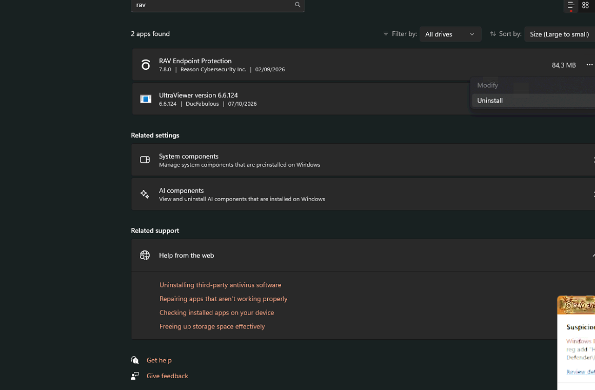

# SERVERHOP 🎯

**Roblox Server Picker for Windows** — paste any game link, see every live server's ping
and player count side by side, then double-click to join the one you want.



> Not affiliated with or endorsed by Roblox Corporation. SERVERHOP only calls Roblox's
> public, undocumented-but-anonymous web endpoints — no login, no cookies, no tokens,
> nothing written outside its own `%LOCALAPPDATA%\ServerHop` folder.

---

## Why?

"Join a random server" is a bad way to find a low-ping, half-full lobby. Roblox's own
server list shows player counts but hides ping, and the website keeps you in a scroll
loop. SERVERHOP pulls the full public server page (up to 100 per load), sorts it however
you want, and fires the documented deep link straight into your chosen instance.

## Features

- **Any link in** — full game URLs, share links, `?placeId=` query strings, the
  `roblox://experiences/start` scheme or a bare number. One parser handles all seven forms.
- **Ping + players per server** — colour-coded ping tiers and a live fill bar for
  population, straight from Roblox's public servers endpoint.
- **Sort your way** — by ping (low first) or by players (high first), with one-click
  direction flip. Your sort mode and direction persist across restarts.
- **JOIN BEST** — one click grabs the lowest-ping server currently listed.
- **Load more** — page through 100-server batches with a single button.
- **Game card** — icon, name, live player count and place/universe ids for whatever you loaded.
- **Auto-refresh** — optional 15-second tick keeps the list current while you browse
  (it backs off automatically when Roblox starts throttling).
- **Remembers your last game** — restart and SERVERHOP reloads the same experience,
  sorted the way you left it.
- **Live activity log** — timestamped, colour-coded, copyable; every request and failure explained.
- **Ship CLI** — `--selftest` runs a 7-point check (5 offline + 2 live, WARN-tolerant),
  plus `--help` / `--version`.

## Usage

1. Double-click `ServerHop.exe`.
2. Paste a game link (or let it restore your last game) and hit **LOAD**.
3. Sort, pick a row, press **JOIN** — or just double-click the row.

The status pill in the header always tells you what it's doing: READY, SCANNING,
`N SERVERS`, RATE LIMITED (wait a few seconds) or ERROR.

## How joining works

SERVERHOP launches:

```
roblox://experiences/start?placeId=<place>&gameInstanceId=<server guid>
```

That's the same deep link Roblox's own site uses — Windows hands it to an installed
Roblox client, which joins that exact instance. If nothing happens, no Roblox client
is installed/registered for the protocol.

## Build from source

Requires the [.NET 10 SDK](https://dotnet.microsoft.com/download/dotnet/10.0)
(`winget install Microsoft.DotNet.SDK.10`).

```powershell
.\build.ps1
# → publish\ServerHop.exe   (single self-contained file, no install needed)
```

Or plain CLI:

```powershell
dotnet publish .\ServerHop.csproj -c Release -r win-x64 --self-contained true `
  -p:PublishSingleFile=true -p:IncludeNativeLibrariesForSelfExtract=true -o publish
```

Every push runs the same pipeline on GitHub Actions
([`.github/workflows/build.yml`](.github/workflows/build.yml)): build → `--selftest` →
upload artifact. Pushing a `v*` tag additionally attaches the exe to a GitHub Release.

### CLI

```
ServerHop.exe --selftest    # 7-check sanity test, live checks WARN-tolerant (exit 0 = pass)
ServerHop.exe --help
ServerHop.exe --version
```

## Repo layout

```
ServerHop/
├── App.xaml(.cs)        startup + hidden CLI modes
├── MainWindow.xaml(.cs) UI shell, load/refresh/join flows, window chrome
├── Core/                RobloxApi · Launcher · Vm · Config · Cli · Log · Paths · Converters
├── Themes/              Palette (acid-green design tokens) + Controls (style library)
├── Assets/              icon + Chakra Petch / JetBrains Mono (OFL licensed, embedded)
├── build.ps1            one-shot single-file publish + selftest
└── docs/screenshot.png
```

## API notes

All requests are anonymous GETs with a browser User-Agent (Roblox 400s generic clients):

| Endpoint | Purpose |
| --- | --- |
| `apis.roblox.com/universes/v1/places/{id}/universe` | place → universe |
| `games.roblox.com/v1/games?universeIds=` | name + live player count |
| `thumbnails.roblox.com/v1/games/icons` | game icon |
| `games.roblox.com/v1/games/{id}/servers/Public` | server pages (ping, players, cursor) |

Roblox rate-limits bursts from a single IP (empty 400 responses), so every call is
retried with growing pauses; the auto-refresh tick stands down when throttled.

## Disclaimer

- Roblox's public web endpoints are not a documented API and can change without notice.
  If a future update breaks SERVERHOP, it will fail soft with a visible status, not silently.
- SERVERHOP never touches your Roblox account, files or settings.
- Use at your own risk.

## License

[MIT](LICENSE) — © 2026 SERVERHOP contributors.

Bundled fonts **Chakra Petch** and **JetBrains Mono** are licensed under the
[SIL Open Font License 1.1](Assets/Fonts/) (full texts ship in the repo).
